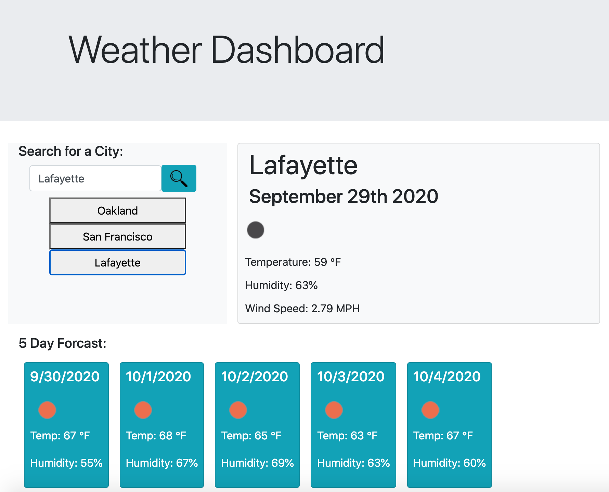

# myWeatherApp
a weather app using an API

## Installation

Deployment:

https://jenryhennifer.github.io/myWeatherApp/


GitHub:

https://github.com/jenryhennifer/myWeatherApp


<hr/>

## Technology Used

* HTML
* BootStrap
* JavaScript
* JQuery
* AJAX
* GitLab
* GitHub

API used:

https://openweathermap.org/


<hr/>

## Sample Image

;


<hr/>

## Description

The purpose of this project was to create a weather application that tells the weather for a desired location. The user is prompted to search for a city. When the search button is clicked, a new button appears below the search bar with the desired city name. Once clicked, the city name, current date, temperature, humidity, and wind speed are displayed along with a visual of the current weather condition. The forcast for the next 5 days will also appear. Each search is saved to the side for quick access.

We used the openweathermap.org API for the data inside this project. I created my own API key for this webpage to access the information. The code below shows how we imported the endpoint of the API into our javascript file and used ajax to access the data.

```
        var weatherURL = "https://api.openweathermap.org/data/2.5/weather?q=" + chosenCity + "&appid=2b648f953cd9f9358d1ca478c103fe4c"

        $.ajax({
            url: weatherURL,
            method: "GET",
            dataType: 'json'

        }).then(function (response) {
            ...
        }
```
This API allowed us to access various information about weather in various cities. For example, the feels like temperature, the temperature max/minimum, weather icon, humidity, pressure, sunrise/sunset and many other features. 

```
            var windSpeed = $('<div>').addClass('tempDetails');
            windSpeed.text('Wind Speed: ' + response.wind.speed + ' MPH');
            $('#todayWeather').append(windSpeed);
```

In the code below, it shows how I overcame my struggle with dynamically programming and created each element for the 5 day forcast individually. 

```
            for (var i = 0; i < response.list.length; i++) {
                if (response.list[i].dt_txt.indexOf("15:00:00") !== -1) {
                    //creating a whole entire card
                    var row = $('<div>').addClass('row');
                    var column = $('<div>').addClass('col-sm-12');
                    var card = $('<div>').addClass('card text-white bg-info');
                    var info = $('<div>').addClass('card-body p-2');
                    var date = $("<h5>").addClass("card-title").text(new Date(response.list[i].dt_txt).toLocaleDateString());

                    //adds the image icon from the data onto the screen 
                    var weatherImage = $('').attr("src", "http://openweathermap.org/img/wn/" + response.list[i].weather[0].icon + ".png");

                    var fiveDayTemperature = $('<p>').addClass('temp');
                    var fiveDayTempF = (((response.list[i].main.temp) - 273.15) * 1.8 + 32).toFixed();
                    fiveDayTemperature.text('Temp: ' + fiveDayTempF + 'F°');
                    var fiveDayHumidity = $('<p>').addClass('humid');
                    fiveDayHumidity.text('Humidity: ' + response.list[i].main.humidity + '%');

                    row.append(column.append(card.append(info.append(date, weatherImage, fiveDayTemperature, fiveDayHumidity))));


                    $('#weekWeather').append(row);
                    $('.forecast').css('display', 'block')

                }
```

<hr/>

## Growth

In this project, I really got a hang of using API's and AJAX. I also got a better grasp on usig JQUERY to dynamically program HTML from my javascript. Unfortunatly, I had difficulties with the UV index, but I am excited about the rest of my page. I see myself progressing quickly in my work.

<hr/>

## License

MIT License

Copyright (c) 2020 Jennifer Henry

Permission is hereby granted, free of charge, to any person obtaining a copy of this software and associated documentation files (the "Software"), to deal in the Software without restriction, including without limitation the rights to use, copy, modify, merge, publish, distribute, sublicense, and/or sell copies of the Software, and to permit persons to whom the Software is furnished to do so, subject to the following conditions:

The above copyright notice and this permission notice shall be included in all copies or substantial portions of the Software.

THE SOFTWARE IS PROVIDED "AS IS", WITHOUT WARRANTY OF ANY KIND, EXPRESS OR IMPLIED, INCLUDING BUT NOT LIMITED TO THE WARRANTIES OF MERCHANTABILITY, FITNESS FOR A PARTICULAR PURPOSE AND NONINFRINGEMENT. IN NO EVENT SHALL THE AUTHORS OR COPYRIGHT HOLDERS BE LIABLE FOR ANY CLAIM, DAMAGES OR OTHER LIABILITY, WHETHER IN AN ACTION OF CONTRACT, TORT OR OTHERWISE, ARISING FROM, OUT OF OR IN CONNECTION WITH THE SOFTWARE OR THE USE OR OTHER DEALINGS IN THE SOFTWARE.

<hr />
<hr />

# Author

Jennifer Henry

* [LinkedIn](https://www.linkedin.com/in/jennifer-henry-4a540a149/)
* [GitHub](https://github.com/jenryhennifer)
* jenhenry1995@gmail.com
